# The Echoes of Akatsu

The Echoes of Akatsu is a responsive fantasy adventure game website created as part of a web development assignment.

## About the Project

The website presents the world of Akatsu, a mysterious fantasy kingdom filled with forgotten magic, ancient relics, and hidden secrets. The player follows Linea, a young apothecary searching for her missing sister.

## Project Notes

This project was built as a multi-page web experience with a consistent visual identity and responsive layout. The design mixes a fantasy aesthetic with a clean editorial style, using structured sections, a sidebar, and a carefully styled navigation system.

The code is organized to keep each page focused on one main purpose:
- the home page introduces the world and story,
- the character page presents the main hero,
- the about page gives personal information and a contact form.

## Pages

- `index2.html` - Homepage and game presentation
- `character.html` - Character presentation
- `About.html` - About the creator and contact form

## Technologies Used

- HTML5
- CSS3
- CSS Grid
- Flexbox
- Responsive design

## Features

- Responsive layout for mobile and desktop
- Navigation between pages
- Fantasy game story presentation
- Character information
- Contact form
- Social media links
- Responsive sidebar and footer

## How to Open the Project

1. Open the project folder in your browser.
2. Launch the homepage file named index2.html.
3. The page is designed to work directly in a browser without requiring any installation.

## Project Structure

- index2.html - landing page for the game world and story
- character.html - character profile page for Linea
- About.html - about-me section with contact form and social links
- css/styles.css - shared styling for the full project
- images/ - all images and screenshots used across the website

## Screenshots

### Laptop view

| Page | Screenshot 1 | Screenshot 2 |
| --- | --- | --- |
| Homepage / Game Presentation | 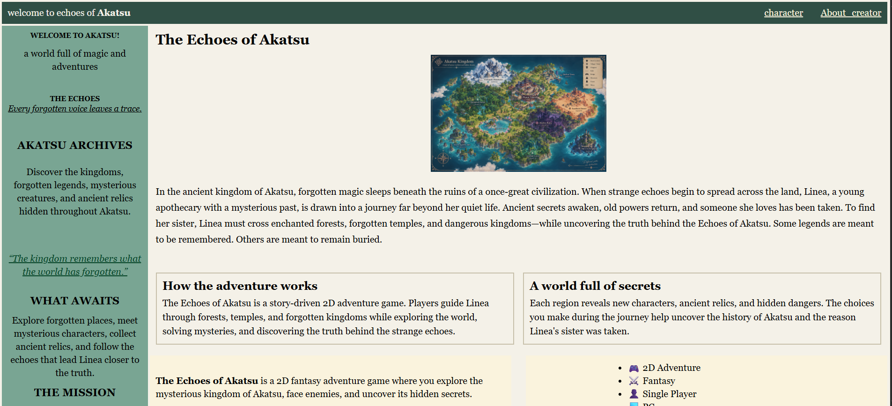 | 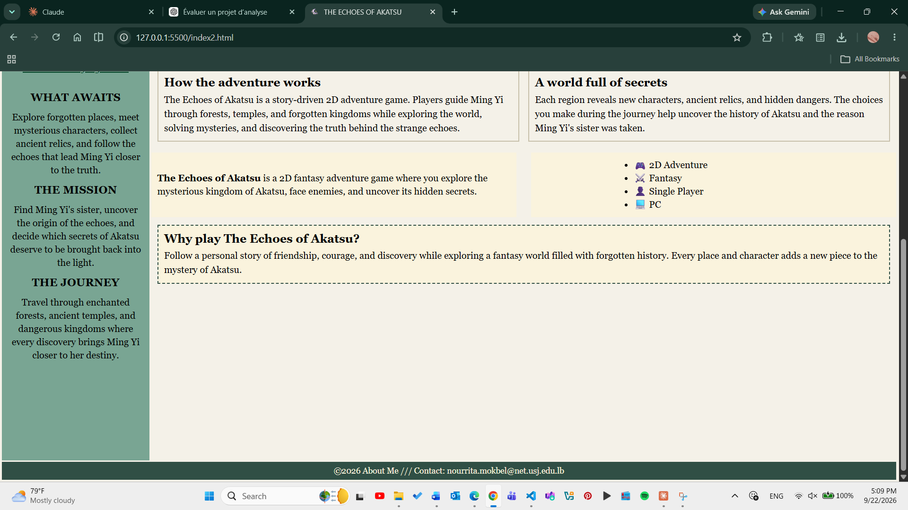 |
| Character Page | 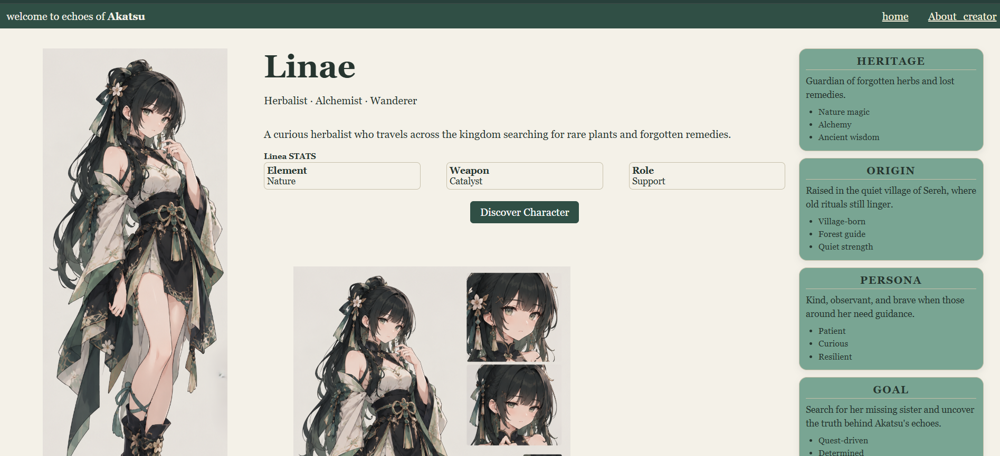 | 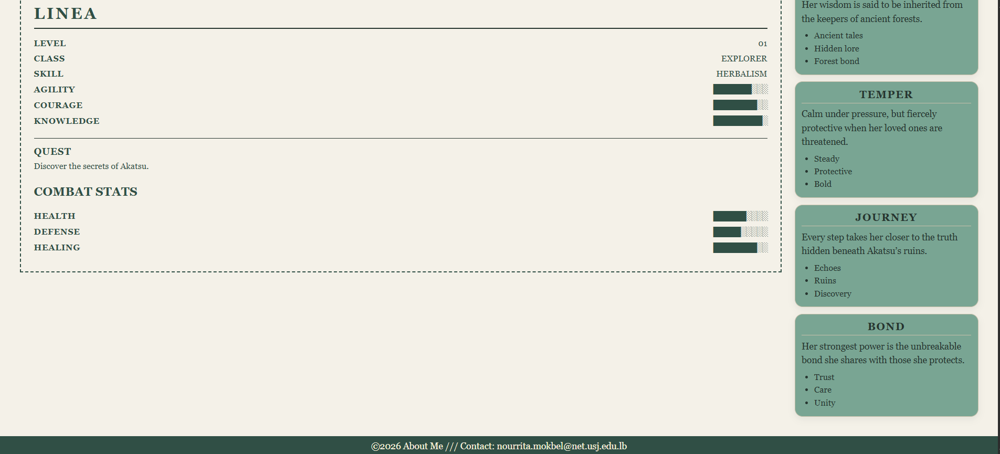 |
| About Page | 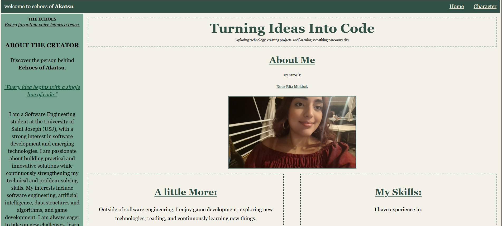 | 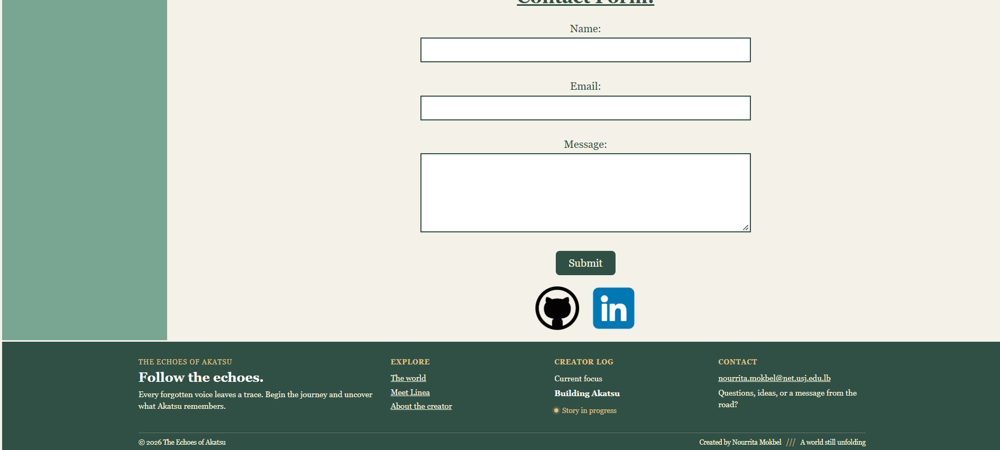 |

### Mobile view

| Page | Screenshot 1 | Screenshot 2 |
| --- | --- | --- |
| Homepage / Game Presentation | 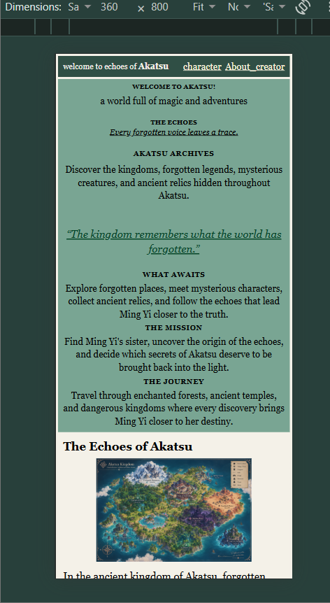 | 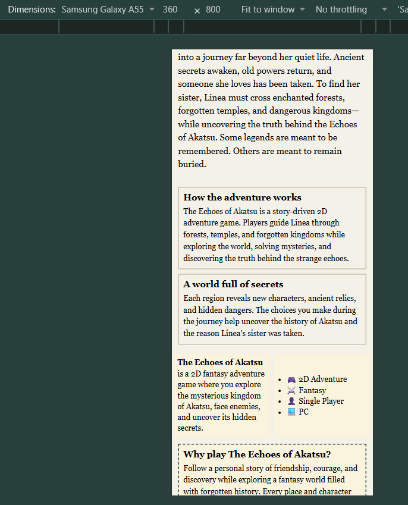 |
| Character Page | 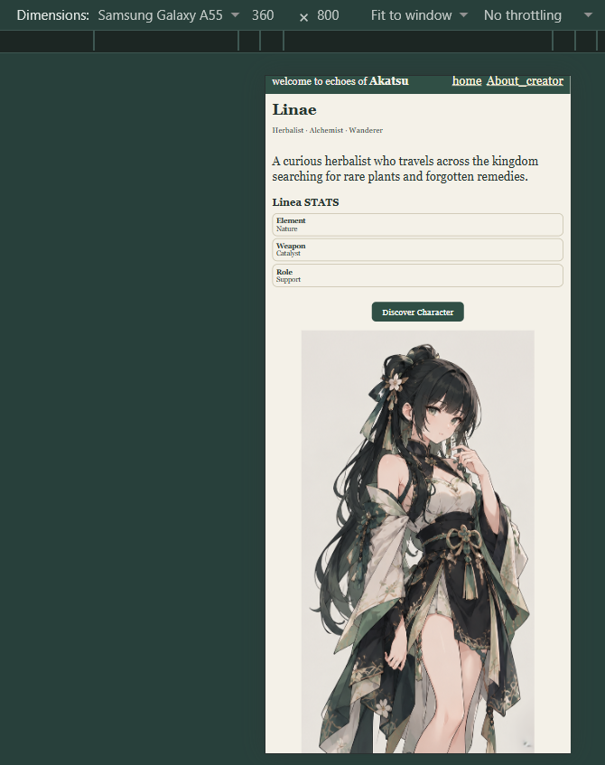 | 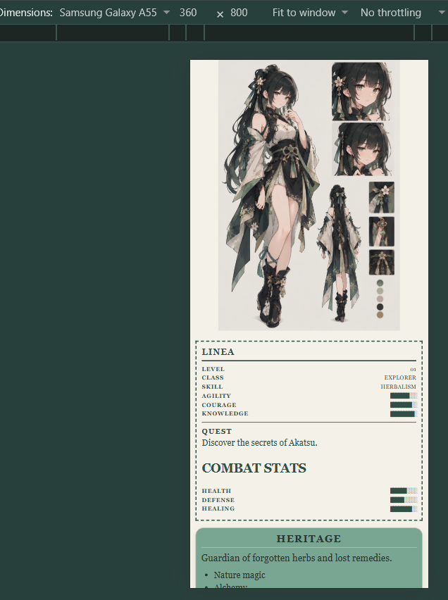 |
| About Page | 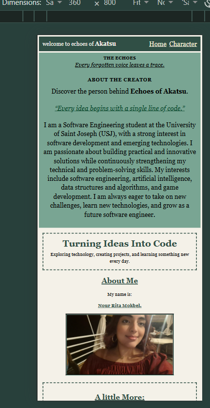 | 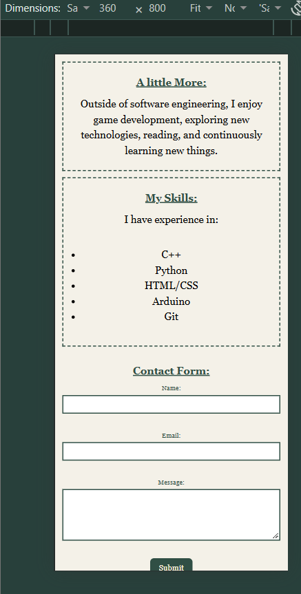 |

> Additional mobile variations are also available in the same folder for each page.

## Author

Nour Rita Mokbel
